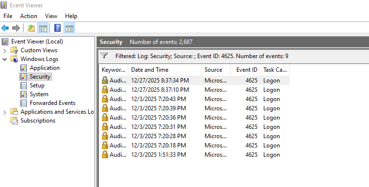
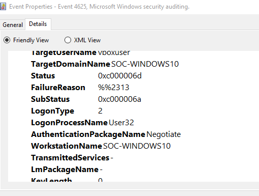
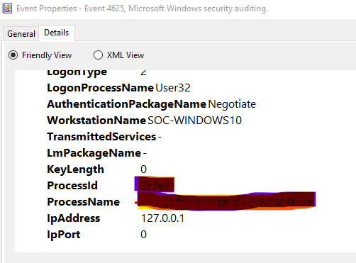
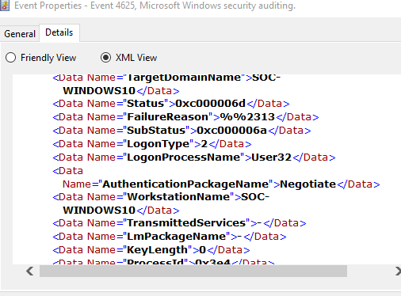

# Failed Login Attempts & Security Event Analysis Lab

## 📌 Project Overview
This project demonstrates hands-on practice in identifying failed login attempts
and basic security events using Windows and Linux virtual machines.

The goal of this lab is to understand how security logs help detect
unauthorized access attempts and potential brute-force attacks.

---

## 🛠 Tools & Technologies Used
- VirtualBox
- Windows 10
- Linux (Ubuntu)
- Event Viewer
- Linux auth logs
- Basic command-line tools
- Wireshark (optional)

---

## 🔍 Scenarios Covered
- Failed user login attempts
- Account authentication failures
- Suspicious login behavior
- Log analysis and correlation

---

## 🪟 Windows Log Analysis
- Analyzed **Event ID 4625** (Failed Logon)
- Identified:
  - Username
  - Logon type
  - Source IP address
- Used Event Viewer for investigation


📸 Screenshots available in:screenshots/windows/

---

## 🐧 Linux Log Analysis
- Analyzed authentication logs:
/var/log/auth.log
- Detected failed SSH login attempts using:

```bash
grep "Failed password" /var/log/auth.log


📸 Screenshots available in:screenshots/linux/

🚨 Key Learnings
Understanding authentication logs
Identifying brute-force indicators
Importance of log monitoring in SOC operations
Hands-on exposure to real security events


📈 Future Improvements
Integrate SIEM (Splunk / Elastic)
Create alert rules
Automate detection using Python

---
### Event ID 4625 – Failed Login Analysis










## 4️⃣ Add Your Analysis Notes (Optional but Powerful)

Create `notes/analysis-steps.md`

## Steps Followed

1. Created Windows and Linux VMs
2. Generated failed login attempts manually
3. Collected authentication logs
4. Analyzed logs to identify suspicious activity
5. Documented findings with screenshots

## Observations
- Multiple failed attempts from same IP indicate brute-force behavior
- Logs provide crucial forensic evidence

